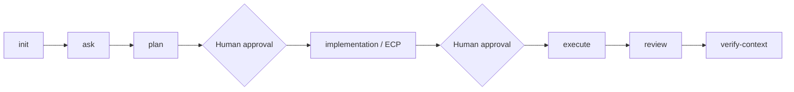
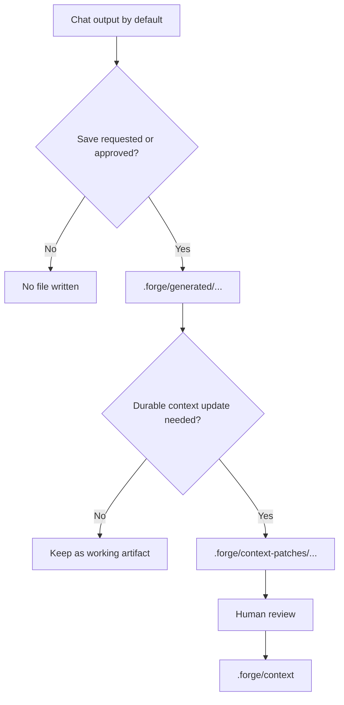

# Forge Context Engine

Forge is a repo-native workflow and context layer for AI coding tools. It gives tools like Codex, Claude Code, and Copilot a shared lifecycle, curated repo context, and safe approval boundaries.

## Why Forge Exists

AI tools are useful, but they drift in three predictable ways:

- context gets lost between sessions
- different tools behave differently
- planning, execution, review, and repo context become ad hoc

Forge keeps the workflow inside the target repository so the assistant sees the same lifecycle, the same context structure, and the same approval boundaries no matter which tool you use.

## What Forge Provides

- `forge init` to install the runtime into a repo
- `forge update` to refresh Forge-managed files later
- shared `.forge/adapter.md` entry behavior
- curated `.forge/context` as the committed source of truth
- tool entrypoints such as `AGENTS.md`, `CLAUDE.md`, and optional Copilot instructions
- lifecycle modes for `init -> ask -> plan -> implementation -> execute -> review -> verify-context`
- optional generated artifacts under `.forge/generated/...`
- reviewable context promotions under `.forge/context-patches/...`

## When To Use Forge

Use Forge when you want:

- one workflow across Codex, Claude Code, and Copilot
- explicit plan and execution approval gates
- repo-local context instead of tool-local memory
- reviewable plans, ECPs, execution reports, and review reports

Skip Forge when you only need a one-off chat answer with no repo context or lifecycle continuity.

## Lifecycle Overview



- `plan` is read-only.
- `implementation` is read-only and produces an ECP/readiness package.
- `execute` may edit only approved scoped files.
- `review` is read-only assessment.
- `verify-context` checks Forge context health only.

## Install

Install from GitHub with `uv`:

```bash
uv tool install git+https://github.com/yogayulanda/forge-context-engine.git
forge --version
```

For local development:

```bash
uv tool install --force --editable ~/projects/forge-context-engine
forge --version
```

## Initialize A Repository

Service repo:

```bash
cd my-service
forge init
```

Workspace repo:

```bash
cd work-context
forge init --workspace
```

Tool selection:

```bash
forge init --tools codex,claude
forge init --tools all
```

## Update An Existing Repo

Preview first:

```bash
forge update --dry-run
```

Apply updates:

```bash
forge update --yes
forge update --tools codex,claude --yes
```

- `--dry-run` previews changes.
- `forge update` refreshes Forge-managed files only.
- user-owned context is preserved.
- local-only files are preserved.
- update is intended to be idempotent.

## Using Forge With AI Tools

Forge keeps the repo contract shared while the tool entrypoints stay thin.

- Codex uses `AGENTS.md`
- Claude Code uses `CLAUDE.md`
- Copilot can use optional `.github/copilot-instructions.md` and prompt wrappers

Example requests:

```text
Use Forge plan mode for adding a small health check function.
```

```text
Use Forge implementation mode for the approved health check plan.
```

```text
Use Forge execute mode for the approved health check ECP.
```

```text
Use Forge review mode to review the executed health check change.
```

## Generated Repo Layout

```text
.
├── AGENTS.md
├── CLAUDE.md
├── .github/
│   └── copilot-instructions.md
└── .forge/
    ├── adapter.md
    ├── forge.config.yaml
    ├── forge-install.yaml
    ├── context/
    ├── generated/
    ├── context-patches/
    ├── temp/
    └── cache/
```

- `.github/copilot-instructions.md` exists only if Copilot is selected.
- `.forge/temp` and `.forge/cache` are local-only.
- `.forge/context` is the curated source of truth.
- `.forge/generated` is for working artifacts when requested or approved.
- `.forge/context-patches` is for reviewable context promotion.

## Generated Artifacts And Context Patches

Artifact policy is chat first.

- Plans, ECPs, execution reports, and review reports are not saved by default.
- Save working artifacts under `.forge/generated/...` only when requested or approved.
- Durable context updates go through reviewed `.forge/context-patches/...` before promotion into `.forge/context`.

Optional artifact flow:



## Recommended First Workflow

Start with one bounded repository question:

```text
Use Forge ask mode to explain how this service handles retries.
```

Then move through the normal path when a change is needed:

1. `ask` to understand current behavior
2. `plan` to shape the change
3. human approval
4. `implementation` to produce the ECP
5. human approval
6. `execute` to apply the approved scope
7. `review` to assess the result
8. `verify-context` if context health may have changed

## What Forge Never Does Automatically

- Forge does not auto-commit.
- Forge does not auto-push.
- Forge does not auto-merge.
- Forge does not auto-open PR/MR.
- Forge does not write generated artifacts by default.
- Forge does not directly mutate `.forge/context` without a reviewed context patch.
- Read-only modes stay read-only by definition.

## Language Policy

- `ui.language` controls human-facing narration and progress updates.
- Forge artifacts remain English by default.
- Commands, file paths, config keys, status enums, and code identifiers are not translated.

## Status

- Current release focus: v0.7 lifecycle dogfood hardening.
- Validated against a real Go repository.
- CLI install/update and lifecycle contracts are working.
- Further polish can continue without changing the lifecycle semantics.

## More Docs

- [Getting Started](docs/getting-started.md)
- [First Workflow](docs/first-workflow.md)
- [Workflow](docs/workflow.md)
- [Mode Selection](docs/mode-selection.md)
- [Artifact Lifecycle Spec](specs/artifact-lifecycle.md)
