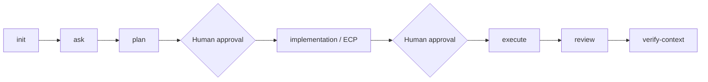
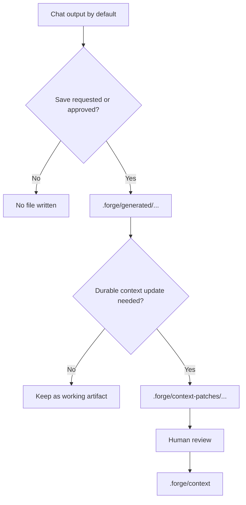

# Forge Context Engine

Forge is a repo-native workflow and context layer for AI coding tools. It gives tools like Codex, Claude Code, and Copilot a shared lifecycle, curated repo context, and safe approval boundaries.

Fresh repo:

```bash
forge init
```

Existing or legacy Forge repo:

```bash
forge update
```

Workspace repo:

```bash
forge init --workspace
```

## Why Forge Exists

AI tools are useful, but they drift in three predictable ways:

- context gets lost between sessions
- different tools behave differently
- planning, execution, review, and repo context become ad hoc

Forge keeps the workflow inside the target repository so the assistant sees the same lifecycle, the same context structure, and the same approval boundaries no matter which tool you use.

## What Forge Provides

- `forge init` to install the runtime into a repo
- `forge update` to refresh Forge-managed files later
- `forge update --dry-run` to preview adoption or managed-file changes safely
- shared `.forge/adapter.md` entry behavior and adapter parity rules
- curated `.forge/context` as the committed source of truth
- tool entrypoints such as `AGENTS.md`, `CLAUDE.md`, and optional Copilot instructions
- lifecycle modes for `init -> ask -> plan -> implementation -> execute -> review -> verify-context`
- optional generated artifacts under `.forge/generated/...`
- reviewable context promotions under `.forge/context-patches/...`

## What Forge Is Not

- not a hosted service, scheduler, CI/CD system, or agent runtime
- not a memory store, vector DB, or background orchestration layer
- not a replacement for repository docs, code, ADRs, or human approval
- not a second workflow per tool; wrappers stay thin and share one repo contract

## When To Use Forge

Use Forge when you want:

- one workflow across Codex, Claude Code, and Copilot
- explicit plan and execution approval gates
- repo-local context instead of tool-local memory
- reviewable plans, ECPs, execution reports, and review reports
- cross-session and cross-tool continuation from saved generated artifacts

Skip Forge when you only need a one-off chat answer with no repo context or lifecycle continuity.

## Lifecycle Overview



- `plan` is read-only.
- `implementation` is read-only and produces an ECP/readiness package.
- `execute` may edit only approved scoped files.
- `review` is read-only assessment.
- `verify-context` checks Forge context health only.

## Install

Install from GitHub with `uv`:

```bash
uv tool install git+https://github.com/yogayulanda/forge-context-engine.git
forge --version
```

For local development:

```bash
uv tool install --force --editable ~/projects/forge-context-engine
forge --version
```

## Initialize A Repository

Fresh service repo:

```bash
cd my-service
forge init
```

Workspace repo:

```bash
cd work-context
forge init --workspace
```

Use workspace repos as thin coordination layers for linked services. Keep repo-specific facts in each service repo's `.forge/context`, and load workspace context only for cross-repo planning.

Tool selection:

```bash
forge init --tools codex,claude
forge init --tools all
```

## Update An Existing Repo

Existing or legacy Forge repo:

```bash
cd initialized-repo
forge update
```

Preview first:

```bash
forge update --dry-run
```

Apply updates:

```bash
forge update
forge update --tools codex,claude
```

- `--dry-run` previews changes.
- `forge update` is the normal adoption and refresh path for existing repos.
- `forge update` refreshes Forge-managed files only.
- user-owned context is preserved.
- local-only files are preserved.
- update is intended to be idempotent.
- use `--yes` for non-interactive automation or scripted adoption.

## Daily Lifecycle

Typical day-to-day flow:

1. `ask` to understand current behavior.
2. `plan` when the change is non-trivial.
3. human approval.
4. `implementation` to produce the ECP.
5. human approval.
6. `execute` to apply the approved scope.
7. `review` to assess the result.
8. `verify-context` only when durable context may need refresh.

## Using Forge With AI Tools

Forge keeps the repo contract shared while the tool entrypoints stay thin.

- Codex uses `AGENTS.md`
- Claude Code uses `CLAUDE.md`
- Copilot can use optional `.github/copilot-instructions.md` and prompt wrappers

Universal artifacts remain tool-neutral across those tools. If a workflow needs tool-specific notes, isolate them under `Target Tool Notes` instead of embedding tool mechanics in shared Plan, ECP, execution report, or review content.

Example requests:

```text
Use Forge plan mode for adding a small health check function.
```

```text
Use Forge implementation mode for the approved health check plan.
```

```text
Use Forge execute mode for the approved health check ECP.
```

```text
Use Forge review mode to review the executed health check change.
```

## Generated Repo Layout

```text
.
├── AGENTS.md
├── CLAUDE.md
├── .github/
│   └── copilot-instructions.md
└── .forge/
    ├── adapter.md
    ├── forge.config.yaml
    ├── forge-install.yaml
    ├── context/
    ├── generated/
    ├── context-patches/
    ├── temp/
    └── cache/
```

- `.github/copilot-instructions.md` exists only if Copilot is selected.
- `.forge/temp` and `.forge/cache` are local-only.
- `.forge/context` is the curated source of truth.
- `.forge/generated` is for working artifacts when requested or approved.
- saved artifact directories are `.forge/generated/plans/`, `.forge/generated/ecp/`, `.forge/generated/reports/`, and `.forge/generated/reviews/`
- `.forge/context-patches` is for reviewable context promotion.

## Generated Artifacts And Context Patches

Artifact policy is chat first.

- Plans, ECPs, execution reports, and review reports are not saved by default.
- Save working artifacts under `.forge/generated/...` only when requested or approved.
- Use human-readable dated kebab-case filenames with an artifact-type suffix and do not overwrite an existing artifact without approval.
- Durable context updates go through reviewed `.forge/context-patches/...` before promotion into `.forge/context`.

Continuation mapping:
- saved plan artifact -> `implementation`
- saved ECP artifact -> `execute`
- saved execution report artifact -> `review`
- saved review report artifact -> follow-up planning or context patch proposal

Boundary summary:
- `.forge/context` is curated source of truth
- `.forge/generated/...` is working output only
- `.forge/context-patches/...` is reviewable promotion proposal only

Continuation guardrails:
- read the artifact first
- verify type-to-mode fit
- verify scope, approval state, and evidence are still sufficient
- block or request more context when the artifact is stale or ambiguous
- do not execute from a plan artifact directly
- do not mutate `.forge/context` from generated artifact content alone

Optional artifact flow:



## Safety Boundaries

- `plan`, `implementation`, and `review` are read-only.
- `execute` edits only approved scoped files.
- Forge does not auto-commit, auto-push, auto-merge, or auto-open PRs.
- Forge does not write generated artifacts by default.
- Forge does not directly mutate `.forge/context` from generated artifacts.
- Copilot support is opt-in and remains a thin wrapper, not a separate runtime.

## Known Limitations

- GitHub install uses `uv`; there is no PyPI release path documented here.
- `forge update` manages Forge-owned files only; it does not migrate arbitrary repo conventions.
- Legacy manifest-less repos can be adopted, but local edits to managed files may require manual review.
- Workspace repos coordinate linked services; they do not replace service-local context.
- Tool syntax differs across Codex, Claude, and Copilot even though the lifecycle contract is shared.

## Troubleshooting

- `forge: command not found`: reinstall with `uv tool install ...` and ensure `uv` tool binaries are on `PATH`.
- Wrong directory: run Forge from the repository root that should contain `AGENTS.md`, `CLAUDE.md`, and `.forge/`.
- Dirty repo before `forge update`: review the diff first; use `forge update --dry-run` before applying changes.
- Managed file conflict: keep your local edits, inspect the conflicting Forge-managed file, and re-run after deciding whether to preserve or replace it.
- Wrapper already exists: Forge adopts Forge-like wrappers when possible and preserves user-owned wrapper content around managed blocks.
- Local junk such as `__pycache__` or `*.pyc`: remove it before release or commit review.

## Release Checklist

- `git diff --check`
- `PYTHONDONTWRITEBYTECODE=1 PYTHONPATH=src python3 scripts/validate_forge_cli.py`
- fresh service init smoke
- workspace init smoke
- legacy/adoption update smoke
- idempotent update dry-run
- runtime/template sync check
- artifact hygiene check
- docs sanity check

## Recommended First Workflow

Start with one bounded repository question:

```text
Use Forge ask mode to explain how this service handles retries.
```

Then move through the normal path when a change is needed:

1. `ask` to understand current behavior
2. `plan` to shape the change
3. human approval
4. `implementation` to produce the ECP
5. human approval
6. `execute` to apply the approved scope
7. `review` to assess the result
8. `verify-context` if context health may have changed

## What Forge Never Does Automatically

- Forge does not auto-commit.
- Forge does not auto-push.
- Forge does not auto-merge.
- Forge does not auto-open PR/MR.
- Forge does not write generated artifacts by default.
- Forge does not directly mutate `.forge/context` without a reviewed context patch.
- Read-only modes stay read-only by definition.

## Language Policy

- `ui.language` controls human-facing narration and progress updates.
- Forge artifacts remain English by default.
- Commands, file paths, config keys, status enums, and code identifiers are not translated.

## Status

- Release hardening target: v0.12.
- Validated against real repo-shaped service and workspace flows.
- CLI install/update and lifecycle contracts are in release-hardening mode, not v1.0 finalization.

## More Docs

- [Getting Started](docs/getting-started.md)
- [First Workflow](docs/first-workflow.md)
- [Workflow](docs/workflow.md)
- [Mode Selection](docs/mode-selection.md)
- [Artifact Lifecycle Spec](specs/artifact-lifecycle.md)
